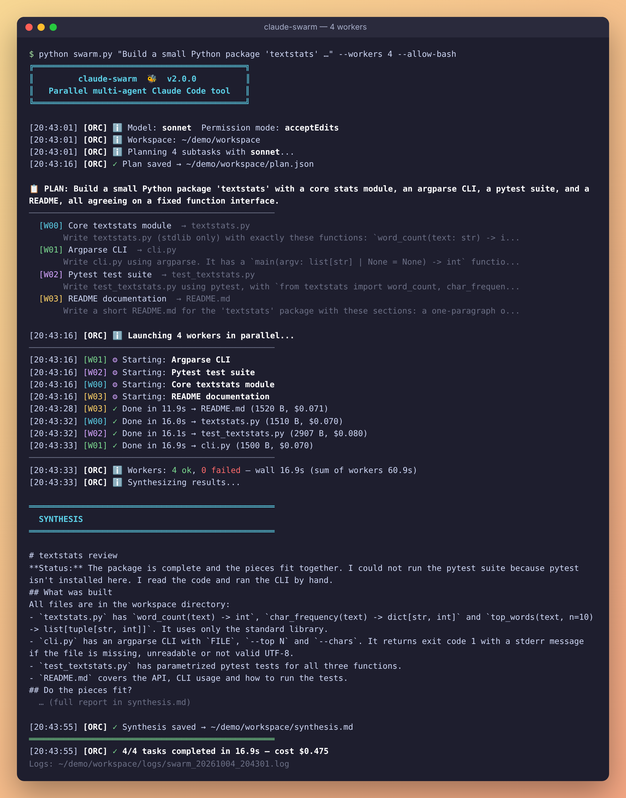
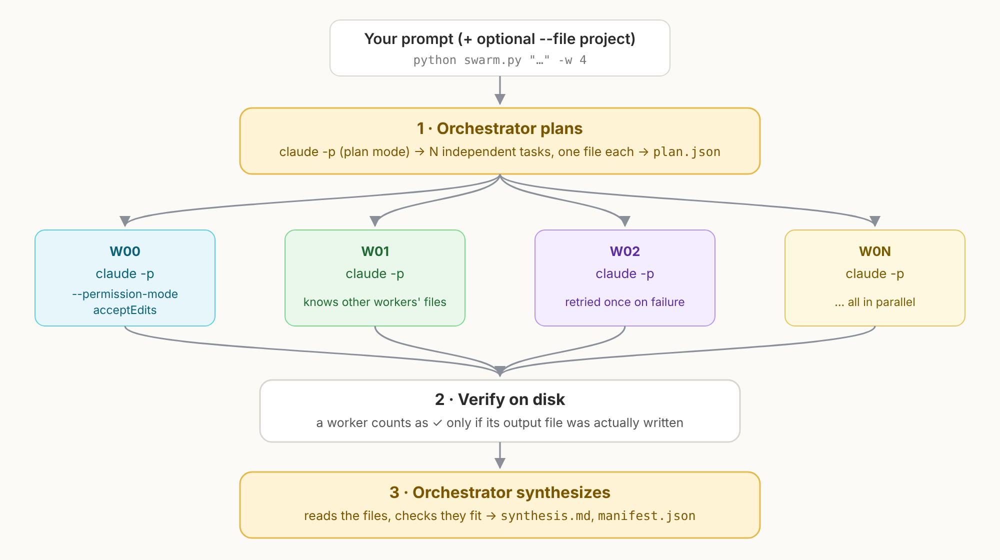
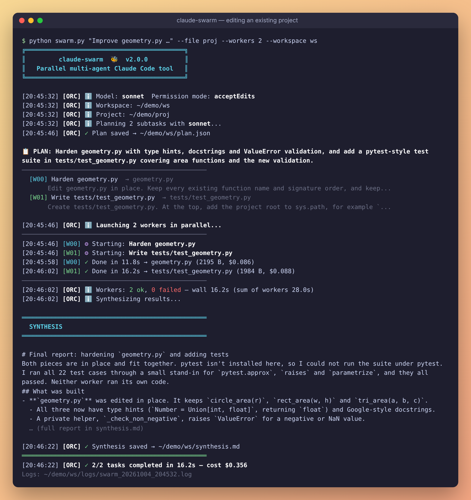

# claude-swarm 🐝

[English](README.md) · **Italiano**

**Orchestratore multi-agente parallelo per Claude Code.** Una sessione Claude divide il problema in N sottocompiti indipendenti, N worker Claude Code headless li risolvono contemporaneamente e l'orchestratore controlla e riassume il risultato.

Un solo file Python, solo libreria standard.



<sub>Un run reale (Sonnet, 4 worker). Percorsi abbreviati in `~/demo`; sintesi tagliata.</sub>

---

## Come funziona



1. **Piano.** L'orchestratore esegue `claude -p` in plan mode (sola lettura) e restituisce un piano JSON: N compiti, un file di output ciascuno. Fissa nelle descrizioni le interfacce condivise (nomi di funzioni, firme), così worker che non comunicano tra loro producono comunque pezzi che combaciano.
2. **Lavoro in parallelo.** Ogni compito gira come processo `claude -p --permission-mode acceptEdits` separato, quindi il worker può davvero scrivere il suo file. Ogni worker sa anche quali file stanno producendo gli altri, così non li sovrascrive.
3. **Verifica.** Un worker conta come riuscito solo se il suo file di output è stato scritto davvero (esiste, non è vuoto, è stato modificato durante il run). Un worker fallito viene rilanciato una volta di default.
4. **Sintesi.** L'orchestratore legge i file prodotti e scrive `synthesis.md`: cosa è stato costruito, se i pezzi combaciano, problemi e prossimi passi.

---

## Requisiti

- [Claude Code](https://docs.claude.com/en/docs/claude-code) installato e con login fatto (`claude` nel `PATH`)
- Python 3.8+ (nessun `pip install` necessario)

## Installazione

```bash
git clone https://github.com/Mariglend/claude-swarm.git
cd claude-swarm
python swarm.py --help
```

---

## Utilizzo

### Costruire qualcosa da zero
```bash
python swarm.py "build a REST API with JWT auth and CRUD endpoints for a users resource" --workers 4
```
I file vengono scritti in `./workspace/`.

### Lavorare su un progetto esistente
```bash
python swarm.py "add type hints and docstrings, and write tests for the validation" --file ./myproject --workers 3
```
Con `--file` i worker leggono il progetto e **scrivono gli output direttamente al suo interno** (modificando file esistenti o creandone di nuovi). Piano, log e sintesi restano in `./workspace/`. Usa git, così puoi rivedere il diff dopo.



### Rivedere il piano prima di spendere token
```bash
python swarm.py "build a CLI tool for file encryption" --plan-only
# controlla / modifica workspace/plan.json, poi:
python swarm.py --from-plan workspace/plan.json
```

### Permettere ai worker di eseguire comandi (es. i test)
```bash
python swarm.py "..." --allow-bash
```

### Modelli diversi per orchestratore e worker
```bash
python swarm.py "complex architecture task" --planner-model opus --model sonnet --workers 6
```

### Tutte le opzioni

```
posizionale:
  prompt                   Descrizione del problema

opzioni:
  -f, --file PATH          Cartella del progetto che i worker possono leggere e modificare
  -w, --workers N          Numero di worker in parallelo (default: 5; con --from-plan: tutti i compiti)
  -m, --model MODEL        Modello per i worker (default: sonnet)
  --planner-model MODEL    Modello per piano e sintesi (default: uguale a --model)
  --workspace PATH         Cartella per piano, log e nuovi file (default: ./workspace)
  --plan-only              Genera solo plan.json
  --from-plan FILE         Salta la pianificazione, esegue un plan.json esistente
  --no-synthesis           Salta la sintesi finale
  --timeout SEC            Timeout per ogni chiamata a claude (default: 600)
  --retries N              Tentativi extra per worker fallito (default: 1)
  --permission-mode MODE   acceptEdits (default) | bypassPermissions | auto | dontAsk
  --allow-bash             Permette ai worker anche comandi da shell
  --claude-bin PATH        Percorso dell'eseguibile claude (oppure CLAUDE_BIN)
  --version
```

Il codice di uscita è `0` se tutti i worker sono riusciti, `2` se almeno uno è fallito.

---

## Struttura dell'output

```
workspace/
├── plan.json          ← la scomposizione fatta dall'orchestratore
├── manifest.json      ← stato, tempo, costo e tentativi per ogni worker
├── synthesis.md       ← report finale
├── textstats.py       ← output dei worker (senza --file)
├── cli.py
├── ...
└── logs/
    ├── swarm_20261004_204301.log   ← log completo del run
    ├── worker_00.txt               ← messaggio finale di ogni worker
    └── ...
```

---

## Risultati misurati

Due run reali con Sonnet (quelli degli screenshot sopra):

| Run | Worker | Durata fase parallela | Somma dei tempi dei worker | Totale (piano + lavoro + sintesi) | Costo riportato da Claude Code |
|---|---|---|---|---|---|
| Pacchetto nuovo (`textstats`: modulo, CLI, test, README) | 4 | 16,9 s | 60,9 s | 54 s | $0,48 |
| Progetto esistente (`--file`, irrobustire un modulo + scrivere test) | 2 | 16,2 s | 28,0 s | 50 s | $0,36 |

Le suite di test generate passano sul codice generato (35/35 e 22/22).

Cosa mostrano e cosa no:
- La fase parallela è durata quanto il worker più lento, non quanto la somma di tutti.
- Piano e sintesi sono sequenziali e aggiungono circa 15–25 s ciascuno. Sui compiti piccoli pesano più di tutto il resto.
- Ogni worker è una sessione Claude Code nuova con il suo contesto iniziale, quindi il costo totale è più alto che fare lo stesso lavoro in una sessione sola. Guadagni velocità e contesti brevi e mirati, non risparmio.
- I costi sono i valori `total_cost_usd` riportati dalla CLI. Con un abbonamento Pro/Max il run consuma invece i tuoi limiti di utilizzo.

---

## Quando usarlo (e quando no)

claude-swarm è più veloce, non più economico. Conviene quando il tempo conta più dei token e il lavoro si divide davvero in pezzi indipendenti.

**Conviene**
- **Tanti lavori simili e separati**: test per 10 moduli, docstring su 20 file, migrare N file a una nuova API, tradurre più documenti. Il tempo totale è circa quello del pezzo più lento.
- **Lavori che riempirebbero un unico contesto**: su compiti lunghi una sessione sola accumula tutto e peggiora verso la fine; ogni worker parte pulito e si concentra su un file.
- **Pezzi che richiedono minuti, non secondi**: piano e sintesi sono un costo fisso (~15–25 s ciascuno), quindi il guadagno si vede solo se la parte parallela è più grande.
- **API a consumo e il tempo vale più dei token** (scadenze, pipeline CI).

**Non conviene**
- **Compiti piccoli**: nei run sopra la fase parallela è durata ~17 s ma il totale ~50 s per via di piano e sintesi; una sessione sola sarebbe probabilmente altrettanto veloce. (Il confronto con una sessione sola non è stato misurato.)
- **Lavori molto accoppiati**: un refactor che tocca tutto, il debug, decisioni di architettura. Serve un solo agente che veda l'insieme.
- **Abbonamento Pro/Max**: worker in parallelo, ognuno con il suo costo di avvio, consumano i limiti di utilizzo più in fretta.
- **Piani vaghi**: se l'orchestratore divide male il lavoro, paghi N worker per pezzi che non combaciano. Usa prima `--plan-only`.

In breve: lavoro grosso, ripetitivo e divisibile → swarm; tutto il resto → un solo `claude`.

---

## Consigli

- Sui lavori grandi usa prima `--plan-only` e controlla che i compiti siano davvero indipendenti.
- Compiti che dipendono l'uno dall'altro (es. "scrivi i test per codice che non esiste ancora") funzionano se il piano fissa l'interfaccia. Altrimenti modifica `plan.json` e lancialo con `--from-plan`.
- 3–6 worker è un intervallo ragionevole. Più worker significa più rischio nel piano e più uso dell'API in parallelo.
- `--permission-mode bypassPermissions` dà ai worker accesso completo. Usalo solo in una sandbox o in una copia usa e getta.

---

## Test

La suite di test usa un finto eseguibile `claude`, quindi gira offline e non costa nulla:

```bash
python -m unittest discover tests -v
```

---

## Progetti correlati

- [claude-resume](https://github.com/Mariglend/claude-resume) — riprende automaticamente Claude Code dopo un rate limit (si abbina bene a claude-swarm)

## Licenza

MIT
